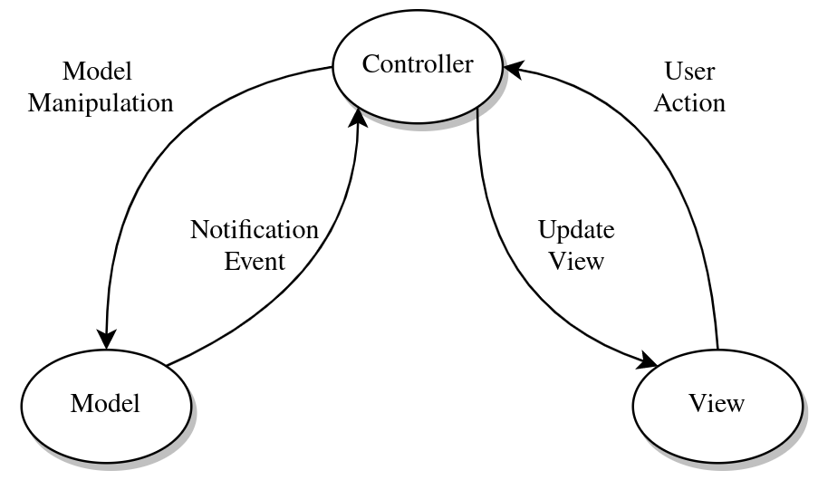
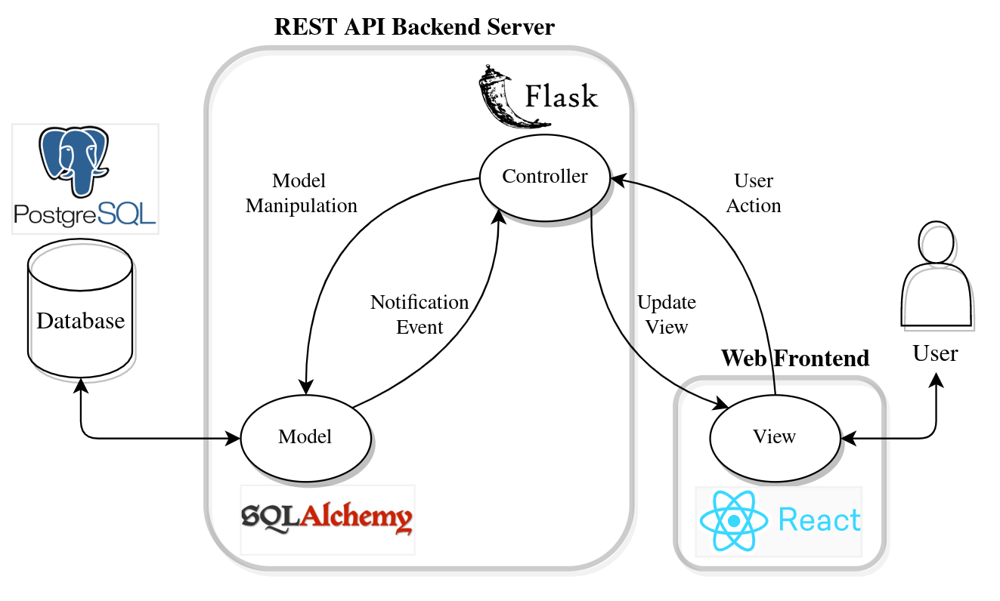

# Teste Kabum
Rafael Fayan - 24/08/2020

## Model-View-Controller Design Pattern

Model-View-Controller (MVC) é um padrão de design de software onde há a separação de responsabilidade de uma aplicação em 3 principais componentes interconectados, com o intuito de maximizar a modularidade e coesão das partes que compõem a aplicação, assim como facilitar a compreensão das etapas que decorrem de uma requisição de usuário.

O primeiro deles, o Model, se encarrega de realizar a lógica de negócio da aplicação construída e geralmente está associado a manipulação dos dados, como por exemplo realizar operações CRUD em um banco de dados, mas não necessariamente.

O componente View é a parte da aplicação responsável por fazer a ponte entre o usuário e a aplicação e apresentar os resultados de suas interações. Muitas vezes ele assume o papel de uma interface web, um aplicativo desktop ou um executável de terminal.

O Controller é quem faz a interface entre os componentes View e Model, se encarregando de receber as requisições iniciadas pelo usuário, tratá-las e converte-las em comandos para que o Model possa efetuar a lógica de negócio da aplicação e retornar os resultados novamente ao controler, que então os encaminha ao componente View para que  seja manipulados de forma que o usuário consiga acessá-los.

Um esquemático ilustrando esse comportamento pode ser visualizado abaixo:





Flask é um framework minimalista construído para python voltado para a criação de aplicações web, fornecendo apenas o básico das funcionalidades e dando aos desenvolvedores liberdade para utilizá-lo em conjunto com outras ferramentas para estendê-lo e criar aplicações mais complexas.

O autoentitulado microframework não impões restrições de design patterns ou ferramentas terceiras, mas ele pode ser facilmente adaptado para seguir o padrão MVC. 

Um exemplo de aplicação seguinte o padrão MVC utilizando Flask e outras ferramentas auxiliares pode ser vista abaixo





No exemplo ilustrado, a parte que compõe o servidor REST engloba as entidades Controller e Model enquanto o frontend da aplicação, como por exemplo uma página web, assumiria o papel de View.


## Python Requests

Um dos pacotes mais utilizados para a criação de APIs, e um pacote essencial do microframework Flask e seus derivados, é o [requests](https://requests.readthedocs.io/).

Saber como manipular os seus métodos e objetos é essencial para a construção das regras a serem executadas na lógica do controller. Existem muitos detalhes sobre o pacote requests, mas os dois fundamentais são comprender as classes [requests.Request](https://requests.readthedocs.io/en/master/api/#requests.Request) e [requests.Response](https://requests.readthedocs.io/en/master/api/#requests.Response).

São através destas duas classes que os métodos mais comuns utilizados, como requests.get() e requests.post(), realizam as suas operações e armazenan os resultados. Abaixo segue um exemplo baixo nível da utilização de algumas classes baixo nível para a realização de uma requisição GET para http://kabum.com.br

```
>>> import requests
>>> request = requests.Request(method="GET", url="http://kabum.com.br")
>>> prepared_request = request.prepare()
>>> session = requests.Session()
>>> response = session.send(prepared_request)
>>> response
<Response [200]>
>>> response.status_code
200
>>> response.url
'http://kabum.com.br/'
>>> response.text
```

Para cada um dos objetos criados, pode-se executar o comando `dir(nome_do_objeto)` para visualizar seus os métodos e propriedades. Em especial, é importante saber extrar as informações de resposta de um objeto da classe requests.Response. Segue um exemplo comando anterior executado no objeto de resposta gerado no exemplo acima:

```
>>> dir(response)
['__attrs__', '__bool__', '__class__', '__delattr__', '__dict__', '__dir__', 
'__doc__', '__enter__', '__eq__', '__exit__', '__format__', '__ge__', 
'__getattribute__', '__getstate__', '__gt__', '__hash__', '__init__', 
'__init_subclass__', '__iter__', '__le__', '__lt__', '__module__', 
'__ne__', '__new__', '__nonzero__', '__reduce__', '__reduce_ex__', 
'__repr__', '__setattr__', '__setstate__', '__sizeof__', '__str__', 
'__subclasshook__', '__weakref__', '_content', '_content_consumed', 
'_next', 'apparent_encoding', 'close', 'connection', 'content', 
'cookies', 'elapsed', 'encoding',  'headers', 'history', 
'is_permanent_redirect', 'is_redirect', 'iter_content', 'iter_lines',
'json', 'links', 'next', 'ok',  'raise_for_status', 'raw', 'reason', 
'request', 'status_code', 'text', 'url']
```

Um outro exemplo abaixo utilizando uma url pública disponibilizada pelos desenvolvedores da ferramenta [Postman](https://www.postman.com), mas desta vez utilizando os métodos mais alto nível disponíveis no pacote.

```
>>> import requests
>>> response = requests.get("https://jsonplaceholder.typicode.com/posts/1")
>>> response.status_code
200
>>> response.json()
{'userId': 1, 'id': 1, 'title': 'sunt aut facere repellat provident occaecati
excepturi optio reprehenderit', 'body': 'quia et suscipit\nsuscipit recusandae
consequuntur expedita et cum\nreprehenderit molestiae ut ut quas totam\nnostrum
rerum est autem sunt rem eveniet architecto'}
```

Verificamos que a resposta do operação GET atraves do método requests.get resultou em um status code de 200 OK e com uma resposta em formato JSON, que pode ser convertida para um dicionário python através do método requests.Response.json().

Fluxos similares podem ser seguidos para outras operações e análises.


## Pacote Flask-RESTful

Como mencionado anteriormente, o framework Flask é um pacote python minimalista que busca providenciar o essencial para criar aplicações web pequenas, mas flexível o suficiente para que ela possa ser integrada e expandida em aplicações maiores.

O pacote [Flask-RESTful](https://flask-restful.readthedocs.io/en/latest/) busca extender as funcionalidades do Flask adicionando abstrações para que a criação de APIs REST com o Flask seja mais fácil e rápida. 

Nele são inclusos classes e métodos que eliminam parte da verbosidade de se criar um endpoint REST em Flask puro, acelerando o ciclo de desenvolvimento e facilitando a manutenabilidade do código base. Em destaque, o pacote oferece utilidades para o roteamento eficiente, parsing de atributos e validação de dados de resposta e entrada.

Diferente da abordagem minimalista do Flask puro, o Flask-RESTful segue um pouco mais a ideia de "baterias inclusas", já oferecendo boa parte das ferramentas necessárias para uma API REST completa. Mas mesmo com essas adições, o pacote continua sendo mais simples e objetivo do que outros frameworks concorrentes que como o [Django](https://www.djangoproject.com/) e o [FastAPI](https://github.com/tiangolo/fastapi).


## Classe flask.views.MethodView

Em vista do crescimento e demanda de pacotes para a criação de APIs REST, o pacote Flask adicionou a classe [flask.views.MethodView](https://flask.palletsprojects.com/en/1.1.x/api/#flask.views.MethodView) para facilitar este processo. 

Diferente do método padrão do pacote de associar para cada função do controlador uma rota e um conjunto de regras de requisição específicas, o Flask se inspirou na abordagem que o Django seguia e criou o conceito de Views em seu pacote. Através deles, é possível agregar com facilidade rotas e métodos HTTP com funcionalidades similares, dado um contexto específico, dentro de uma classe única.

A classe `flask.views.MethodView` é um dos tipos de Views disponíveis, sendo especificamente direcionado para o uso em APIs REST. A idéia por trás é que os métodos HTTP (GET, POST, DELETE, etc) para uma collection em específica estará centralizada em uma única classe, e através dela é fornecido conectores para incluir seus roteamentos na classe Flask principal.

Análogo a ele, o pacote Flask-RESTful expande esta idéia através da classe [flask_restful.Resource](https://flask-restful.readthedocs.io/en/latest/quickstart.html#resourceful-routing), construindo em cima do MethodView do Flask e adicionando algumas funcionalidades extras.

## Exemplo prático

Para demonstrar os conceitos mencionados, foi criado um servidor REST utilizando o pacote Flask-RESTful em conjunto com o pacote [SQLAlchemy](https://www.sqlalchemy.org/) para a extração de dados mockados de um banco de dados [PostgreSQL](https://www.postgresql.org/).

Os casos de exemplo para serem usados no banco de dados mockados foram fornecidos nos links abaixo:

[https://servicespub.prod.api.aws.grupokabum.com.br/descricao/v1/descricao/produto/85197](https://servicespub.prod.api.aws.grupokabum.com.br/descricao/v1/descricao/produto/85197)

[https://servicespub.prod.api.aws.grupokabum.com.br/descricao/v1/descricao/produto/79936](https://servicespub.prod.api.aws.grupokabum.com.br/descricao/v1/descricao/produto/79936)

[https://servicespub.prod.api.aws.grupokabum.com.br/descricao/v1/descricao/produto/87400](https://servicespub.prod.api.aws.grupokabum.com.br/descricao/v1/descricao/produto/87400)

O repositório público hospedado no Github contendo o código implementado se encontra no link a seguir:

[Kabum Products REST API Server - Github Repository](https://github.com/rfayan/kabum_product_api)

Maiores detalhes e explicações sobre como executar o projeto se encontram no arquivo README.md
